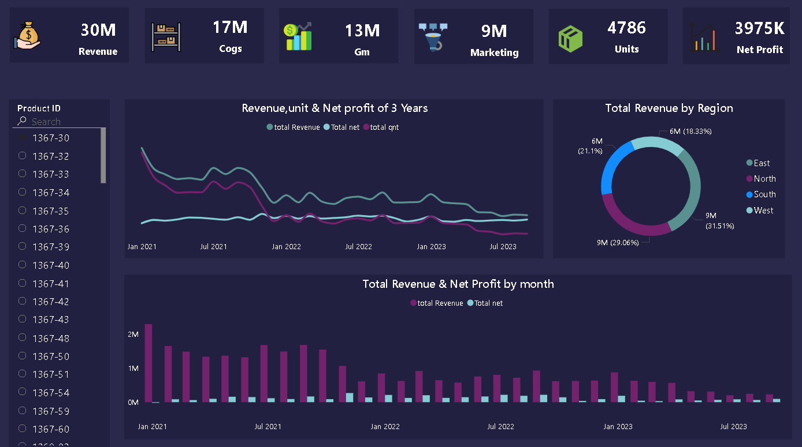

# 📊 Product Analysis Dashboard – Power BI

### 🚀 Project Overview
The **Product Analysis Dashboard** provides actionable insights into product performance, regional sales, and profitability trends.  
This dashboard was designed to help management understand **which products, regions, and brands drive business growth**, identify low-performing areas, and make informed strategic decisions.

---

## 🧠 Problem Statement
Despite steady sales growth, the company lacked clear visibility into the **drivers of profitability** across different products and regions.  
Management needed a centralized Power BI dashboard to monitor:
- Monthly revenue and profit trends  
- Regional performance  
- Product-level insights on sales, cost, and marketing efficiency  

The goal was to transform raw data into an **interactive performance dashboard** for better decision-making.

---

## 🗂️ Dataset Overview
Two main datasets were used in this analysis:

### 🧾 Product Table
| Column | Description |
|---------|-------------|
| Product ID | Unique identifier for each product |
| Brand | Brand name of the product |
| Category | Product category or segment |
| Product Name | Name of the product |

### 💰 Sales Table
| Column | Description |
|---------|-------------|
| Product ID | Foreign key linking to Product table |
| Region | Sales region |
| Month | Month of sale |
| Qty | Quantity sold |
| Rev | Revenue generated |
| Cogs | Cost of goods sold |
| GM | Gross margin |
| Marketing | Marketing cost incurred |
| Net Profit | Final profit after all expenses |

---

## 📈 Dashboard Features
The Power BI dashboard consists of **one interactive page** designed for quick insights and trend analysis.

### 🧩 **Key Components**
- **KPIs (6 Total):**
  - Total Revenue  
  - Total Quantity Sold  
  - Total Gross Margin  
  - Total Marketing Spend  
  - Total Net Profit  
  - Profit Margin %

- **Line Chart:**  
  Monthly and yearly trend of Revenue, Net Profit, and Quantity Sold.

- **Regional Performance:**  
  Comparison of Revenue and Net Profit across different regions.

- **Product Slicer:**  
  Interactive slicer for filtering by Product ID or Brand.

---

## ❓ Key Business Questions Answered
1. What is the **total revenue, gross margin, and net profit** across all products and regions?  
2. Which **regions** generate the highest **revenue and profit**?  
3. How have **sales and profits** trended over time (month/year)?  
4. Which **products or brands** contribute most to total sales and profit?  
5. How does **marketing spend** impact **revenue and profitability**?  
6. What is the **average profit margin** by category or brand?  
7. Which time periods show **the strongest overall performance**?

 

## 🧰 Tools & Technologies
- **Microsoft Power BI** – for data modeling, DAX, and interactive visualization  
- **Excel / CSV** – for data cleaning and preprocessing  
- **DAX Measures** – for calculating KPIs such as Profit Margin %, Total Revenue, and Net Profit  

---

## 🪄 How to Use This Dashboard
1. Download and open the file: `Product_Analysis_Dashboard.pbix` in **Power BI Desktop**.  
2. Use the slicer to explore by **Product ID** or **Brand**.  
3. Hover over visuals to view detailed tooltips and comparisons.  
4. Analyze trends and KPIs to discover actionable insights.

